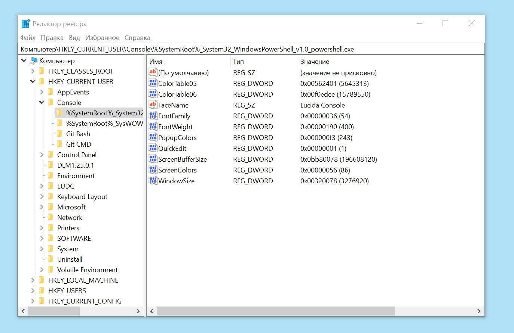
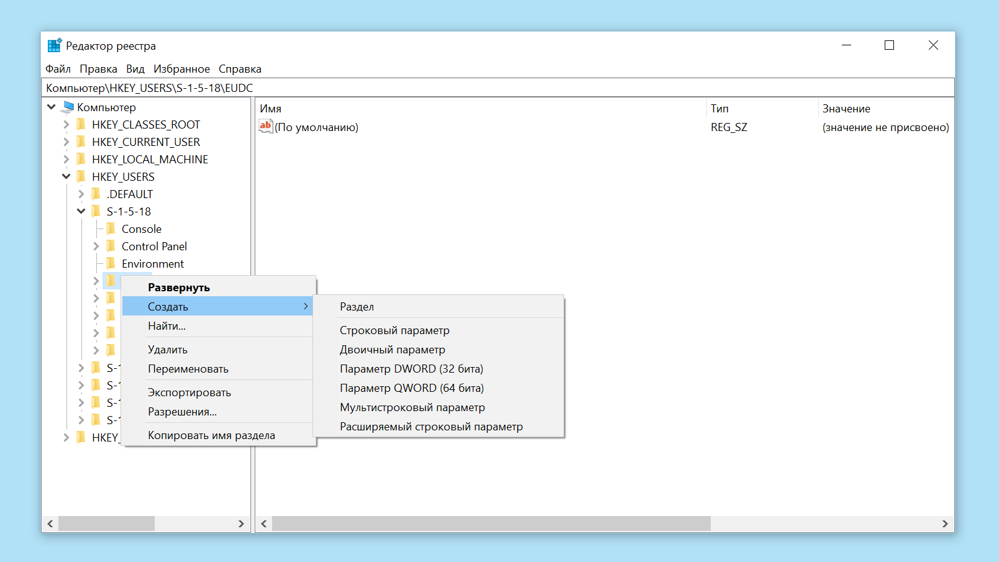
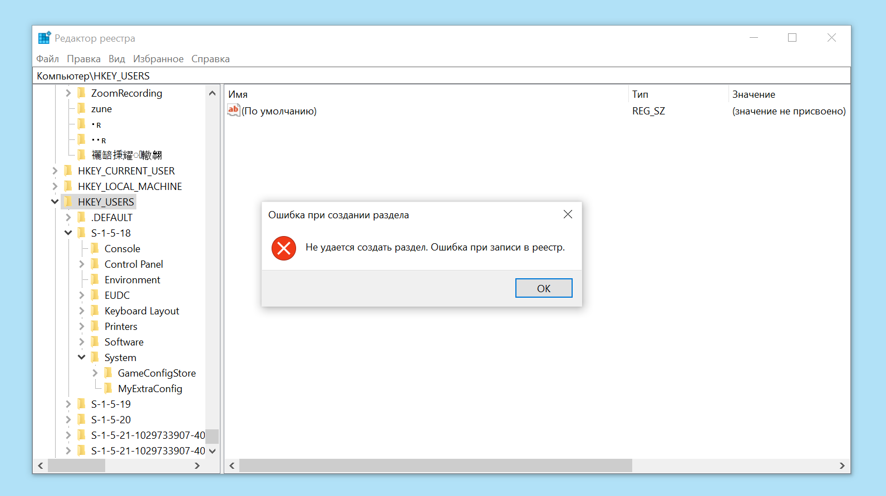
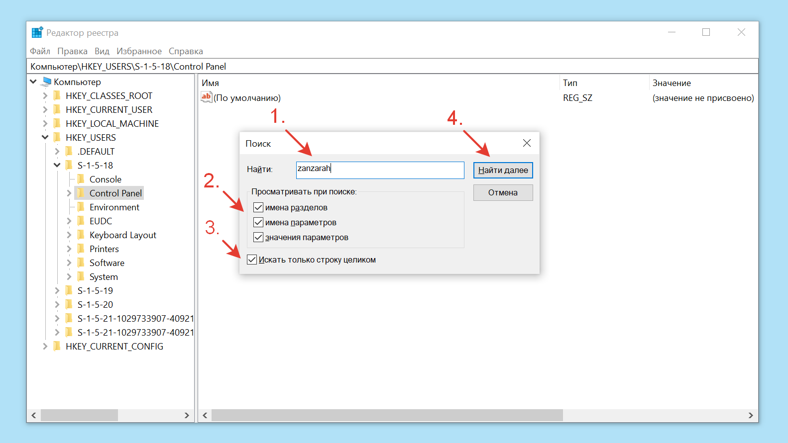
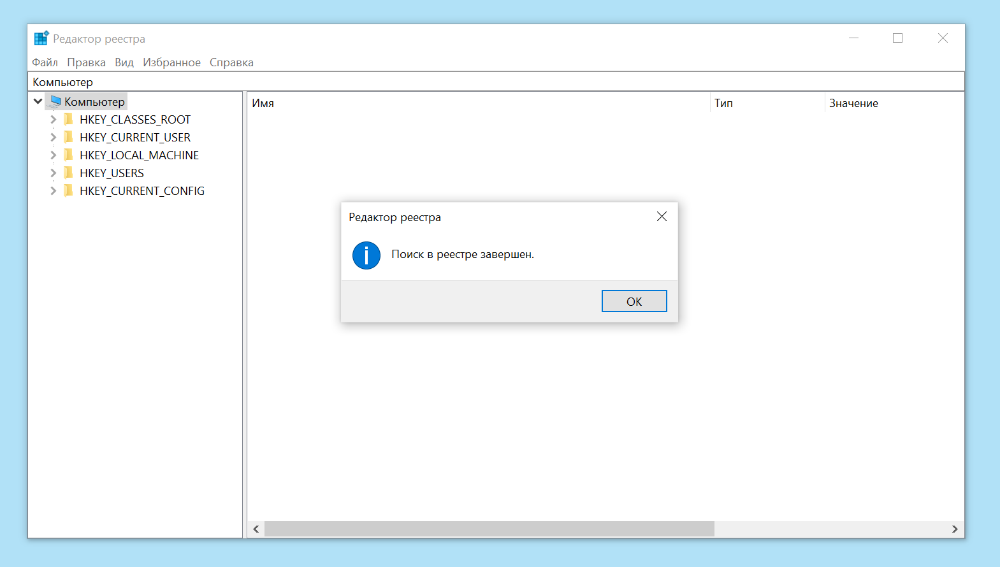
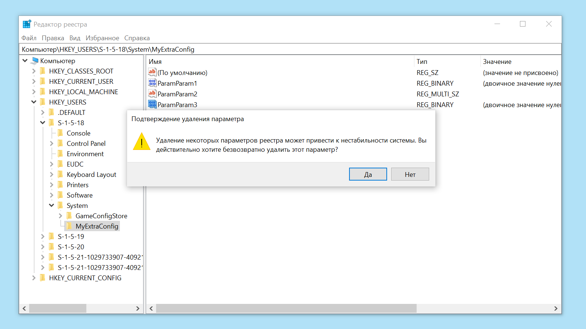
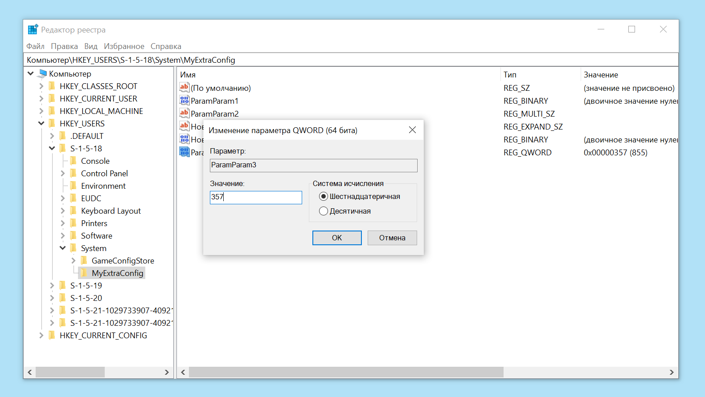

# Как пользоваться редактором реестра Windows. Что делать, если ничего не получается

## Что такое редактор реестра

**Редактор реестра Windows** или **regedit** (от англ. *registry editor* – «редактор реестра») – системное приложение, которое позволяет просматривать и изменять записи в реестре Windows (базе данных, где операционная система и установленные программы хранят конфигурации, необходимые для корректной работы).

С помощью **редактора реестра** можно изменить параметры программ, которые недоступны в пользовательском интерфейсе.

 

## Перед началом работы: рекомендации по безопасности

> **Важно!**   Во время работы в **редакторе реестра** вы можете повредить параметры, необходимые для нормальной работы операционной системы.
> Перед тем, как вносить изменения в реестр Windows, [создайте резервную копию](#создать-резервную-копию) реестра. Это поможет вам [восстановить корректные параметры реестра](#восстановить-резервную-копию-реестра-windows) в случае ошибки.

 

## Как открыть редактор реестра

Чтобы открыть **редактор реестра**:

1. Откройте главное меню Windows, кликнув левой кнопкой мыши на символ **«Пуск»** <i class="fa fa-windows" aria-hidden="true"></i> на Панели задач или нажав на кнопку с символом <i class="fa fa-windows" aria-hidden="true"></i> на клавиатуре.
2. При активном главном меню Windows начните вводить *«regedit»* или *«редактор реестра»*. В списке программ появится строка ***Редактор реестра***.
3. Кликните правой кнопкой мыши по строке ***Редактор реестра***, в появившемся контекстном меню выберите ***Запустить от имени администратора***.
4. При появлении окна ***Разрешить этому приложению вносить изменения на вашем устройстве?*** нажмите ***Да***.

*Нажмите «Да» в диалоге «Разрешить этому приложению вносить изменения на вашем устройстве?»*

 

## Окно редактора реестра

В окне **редактора реестра** отображена древовидная структура реестра: листьями дерева являются конкретные параметры и их значения. Они сгруппированы в разделы, из которых складываются ветки дерева.
Окно **редактора** похоже на окно Проводника Windows, оно разбито на две части:

* в левой части показаны вложенные разделы,
* в правой части окна показаны названия и значения конкретных параметров.

*Окно редактора реестра*

 

### Создать резервную копию реестра Windows

Чтобы создать резервную копию реестра Windows:

1. В верхней строке меню **редактора реестра** в разделе ***Файл*** выберите пункт ***Экспортировать***, кликнув на него левой кнопкой мыши.
2. В появившемся окне ***Экспорта файла реестра***:
   * выберите расположение файла реестра и задайте его имя;
   * в нижней части окна найдите раздел ***Диапазон экспорта*** и убедитесь, что он задан правильно: ***Весь реестр***;
   * нажмите кнопку *Сохранить*.
3. Убедитесь, что файл реестра создан: в указанной вами папке найдите файл с указанным вами имеем и расширением .reg

 

### Восстановить резервную копию реестра Windows

Чтобы восстановить резервную копию реестра Windows:

1. В верхней строке меню **редактора реестра** в разделе ***Файл*** выберите пункт ***Импортировать***, кликнув на него левой кнопкой мыши.
2. В появившемся окне ***Импорт файла реестра*** выберите созданный ранее файл реестра с расширением .reg и нажмите кнопку ***Открыть***.

> **Важно!**   Не используйте для импорта файл реестра с другого устройства. Это может привести к необратимой поломке системы и необходимости переустановить Windows.

 

## Как создать раздел или параметр

Чтобы создать раздел или параметр в **редакторе реестра**:

1. В левой части окна **редактора** выберите раздел, внутри которого нужно создать раздел или параметр.
2. Кликните правой кнопкой мыши по выбранному разделу. В появившемся контекстом меню в разделе ***Создать*** выберите нужный пункт: создание раздела или параметра необходимого вам типа.
3. Введите имя раздела или параметра и нажмите ***Enter*** или кликните вне названия созданного раздела или параметра.

*Контекстное меню создания раздела или параметра в редакторе реестра*

В некоторых разделах невозможно создать вложенные разделы. Если вы попытаетесь это сделать, появится сообщение об ошибке:

*Ошибка при создании раздела в редакторе реестра*

 

## Как найти раздел или параметр

Чтобы найти раздел или параметр в **редакторе реестра**:

1. В левой части окна **редактора** выберите раздел, в котором требуется осуществить поиск. Если вы не знаете, какой раздел выбрать, выберите самый верхний раздел ***Компьютер***: так поиск будет осуществлен во всех разделах.
2. В верхней строке меню **редактора** в разделе ***Правка*** выберите пункт ***Найти***, кликнув на него левой кнопкой мыши, или нажмите сочетание клавиш ***Ctrl*** и ***F***.
3. В появившемся окне ***Поиск***:
   * введите название искомого раздела или параметра,
   * ниже отметьте галочками, где нужно искать заданную вами строку: в имени раздела, в имени параметра или в значении параметра.
   * если нужно, отметьте параметр ***Искать строку целиком***,
   * кликните ***Найти далее*** или нажмите ***Enter***.
4. В зависимости от результатов поиска:
   * если искомая строка найдена, просмотрите результаты поиска. Если строка найдена в нескольких разделах и параметрах, для просмотра следующего найденного результата нажмите ***F3*** или кликните ***Найти далее*** в разделе ***Правка*** верхнего меню **редактора реестра**.
   * если искомая строка не найдена, вы увидите сообщение ***Поиск в реестре завершен***.

> Если поиск не дал результатов, проверьте раздел, в котором вы осуществляли поиск: возможно, был задан некорректный раздел.

*Окно Поиска в редакторе реестра*

*Уведомление о завершении поиска без найденных результатов*

 

## Как переименовать раздел или параметр

Чтобы переименовать раздел или параметр в **редакторе реестра**:

1. Если требуется переименовать раздел, выберите его в левой части окна **редактора**. Если требуется переименовать параметр, найдите его в правой части окна **редактора**.
2. Кликните правой кнопкой мыши по выбранному разделу или параметру. В появившемся контекстом меню выберите пункт ***Переименовать***.
3. Введите новое имя раздела или параметра и нажмите ***Enter*** или кликните вне названия созданного раздела или параметра.

 

## Как удалить раздел или параметр

Чтобы удалить раздел или параметр в **редакторе реестра**:

1. В окне **редактора** кликните правой кнопкой мыши по разделу или параметру, который хотите удалить.
2. В появившемся контекстном меню выберите пункт ***Удалить***.
3. В появившемся диалоговом окне ***Подтверждение удаления раздела*** или ***Подтверждение удаления параметра*** нажмите ***Да***.

> **Важно!**  При удалении раздела удаляются также все вложенные в него разделы. Перед подтверждением удаления убедитесь, что удаление вложенных разделов не приведет к ошибке.

*Окно подтверждения удаления параметра в редакторе реестра*

 

## Как изменить значение параметра

Чтобы изменить значение параметра в **редакторе реестра**:

1. В окне **редактора** кликните правой кнопкой мыши по параметру, значение которого вы хотите изменить.
2. В появившемся контекстном меню выберите пункт ***Изменить*** или ***Изменить двоичные данные***.
3. В появившемся диалоговом окне ***Изменение параметра*** введите необходимое значение.
4. После завершения изменения значения кликните ***ОК*** или нажмите ***Enter***.

*Окно изменения значения параметра в редакторе реестра*

> **Важно!**   Работа в **редакторе реестра** может существенно повлиять на работу операционной системы. Если вы не уверены в изменениях, которые хотите внести в реестр, рассмотрите способы решения задачи без использования **редактора реестра**.