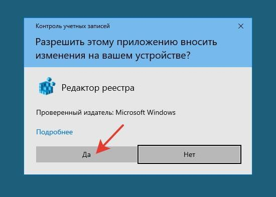

# Как пользоваться редактором реестра Windows. Что делать, если ничего не получается

## Что такое редактор реестра

**Редактор реестра Windows** или **regedit** (от англ. *registry editor* – «редактор реестра») – системное приложение, которое позволяет просматривать и изменять записи в реестре Windows (базе данных, где операционная система и установленные программы сохраняют все виды конфигураций, необходимых для работы).

С помощью **редактора реестра** можно изменить параметры программ, которые недоступны в пользовательском интерфейсе. Например, можно: исправить и изменить очень многие параметры, улучшить и ускорить работу операционной системы, отключить ненужные функции и наоборот, включить те, что необходимы для работы лично вам.

## Как работает редактор реестра

Реестр Windows — это база данных, где операционная система и многие приложения сохраняют все виды конфигураций. Здесь хранятся нужные драйвера, установленные разработчиками и самим пользователем на конкретном устройстве, учетные записи, информация о видах файлов.

При установке программы в реестр записывается информация, которая нужна для запуска и корректной работы данной программы. При открытии программы операционная система использует параметры из реестра нужную ин

В этом реестре мы можем найти все виды значений и настроек, которые позволяют нам изменять даже самый немыслимый элемент операционной системы. Конечно, хотя его структура разделена на дерево каталогов, это вовсе не интуитивный инструмент.

## Перед началом работы: рекомендации по безопасности

>  **Важно!** Редактирование реестра Windows — рискованное занятие. Во время работы в редакторе реестра вы можете повредить параметры, необходимые для нормальной работы операционной системы.
> Перед тем, как вносить изменения в реестр, создайте резервную копию значений реестра. Это поможет вам восстановить корректные значения в случае ошибки.

### Создать резервную копию

1. В левой части окна **редактора реестра** кликните правой кнопкой мыши на раздел *Компьютер*. В появившемся меню выберите пункт *Экспортировать*, кликнув на него левой кнопкой мыши.
2. В появившемся окне ***Экспорта файла реестра***:
   * выберите расположение файла реестра и задайте его имя;
   * в нижней части окна найдите раздел ***Диапазон экспорта*** и убедитесь, что он задан правильно: ***Весь реестр***;
   * нажмите кнопку *Сохранить*.
3. Убедитесь, что файл реестра создан: в указанной вами папке найдите файл с указанным вами имеем и расширением .reg

### Восстановить резервную копию

Вы можете восстановить резервную копию 

## Как открыть редактор

### 1. Из меню «Пуск»

Чтобы открыть **редактор реестра** из меню «Пуск», выполните следующие действия:
**Шаг 1.** Откройте главное меню системы Windows, кликнув левой кнопкой мыши на символ <i class="fa fa-windows" aria-hidden="true"></i> на Панели задач Windows или нажав на кнопку с символом <i class="fa fa-windows" aria-hidden="true"></i> на клавиатуре.
**Шаг 2.** В главном меню Windows в строке поиска введите **regedit** или **редактор реестра**.
**Шаг 3.** В списке программ появится строка программы 

> 

### 2. Комбинацией клавиш Win + R

### 3. С помощью исполняемого файла .exe

Перед вами должно появиться окно **редактор реестра**:

Если во время открытия

## Окно редактора

Окно Редактора реестра похоже на окно Проводника Windows: окно разбито на две части. В левой части окна показаны разделы п, а в правой — название и значение конкретных реестров.

## Как создать новый раздел
## Как создать новый раздел

## Как изменить значение реестра

## Как удалить значение реестра

## Узнать больше
