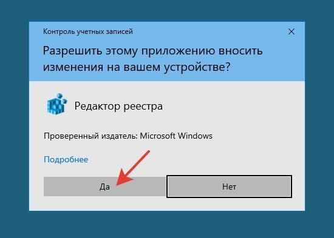

#Как пользоваться редактором реестра Windows. Что делать, если ничего не получается

## Что такое редактор реестра

**Редактор реестра Windows** или **RegEdit** (от англ. *registry editor* – «редактор реестра») – 

Используя правку реестра (regedit) Windows можно исправить и изменить очень многие параметры, улучшить и ускорить работу операционной системы, отключить ненужные функции и наоборот, включить те, что необходимы для работы лично вам.

## Как работает редактор реестра

Реестр Windows является база данных где сама операционная система и многие приложения сохраняют все виды конфигураций. Все функции операционной системы, как те, которые включены, так и те, которые не включены, хранятся здесь. Здесь хранятся нужные драйвера, установленные разработчиками и самим пользователем на конкретном устройстве, учетные записи, информация о видах файлов.

В случае установки на устройстве какой-либо программы в реестр копируется информация, которая нужна для запуска и бесперебойной ее работы. В том случае, когда пользователь подключает другое устройство, в реестр также копируются сведения о его драйверах. При открытии разных программ, операционная система копирует и изымает из реестра нужную информацию.

В этом реестре мы можем найти все виды значений и настроек, которые позволяют нам изменять даже самый немыслимый элемент операционной системы. Конечно, хотя его структура разделена на дерево каталогов, это вовсе не интуитивный инструмент.

## Перед началом работы: рекомендации по безопасности

> Редактор реестра – мощный инструмент, дающий широкие возможности. 

#### Создать резервную копию

#### Восстановить резервную копию

## Как открыть редактор

##### 1. Из меню «Пуск»
Чтобы открыть **редактор реестра** из меню «Пуск», выполните следующие действия:
**Шаг 1.** Откройте главное меню системы Windows, кликнув левой кнопкой мыши на символ <i class="fa fa-windows" aria-hidden="true"></i> на Панели задач Windows или нажав на кнопку с символом <i class="fa fa-windows" aria-hidden="true"></i> на клавиатуре.
**Шаг 2.** В главном меню Windows в строке поиска введите **regedit** или **редактор реестра**.
**Шаг 3.** В списке программ появится строка программы 

> 

##### 2. Комбинацией клавиш Win + R

##### 3. С помощью исполняемого файла .exe

Перед вами должно появиться окно **редактор реестра**:

Если во время открытия 

## Окно редактора

## Как создать значение реестра

## Как удалить значение реестра

## Узнать больше